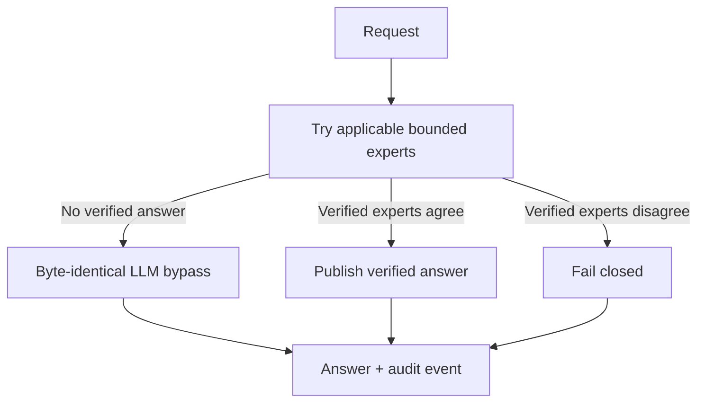

# MAT Nexus

**A fail-safe verified-expert layer for local language models.**

MAT Nexus is an experimental, model-agnostic orchestration architecture. It
lets bounded deterministic experts answer only when they can prove a result.
When no expert qualifies, the request bypasses Nexus and reaches the original
LLM unchanged.

> Public portfolio edition. The production engine, expert implementations,
> model weights, private evaluation data, and training pipeline are not part of
> this repository.

## Live evidence dashboard

The public, mobile-friendly dashboard is generated from a versioned aggregate
catalog. It separates audited paired comparisons from diagnostic, exploratory,
running and invalidated campaigns.

- [Open the dashboard](https://sxc3030-eng.github.io/mat-nexus-showcase/)
- [Reusable JSON catalog](results/public-benchmark-catalog.json)
- [Reusable CSV export](results/primary-comparisons.csv)
- Validate and regenerate exports with `python tools/validate_catalog.py`

## The product hypothesis

Small local models do not need another generative voice in every request. They
need a dependable companion that knows when a result can be verified and when
to stay out of the way.

The central safety property is simple:

> If no expert can prove an answer, Nexus must not alter the model's prompt or
> response path.

## Audited early results

These are paired, fresh-question experiments on self-contained, verifiable
tasks. They are **not** claims of universal reasoning improvement.

| Campaign | Model | Raw LLM | LLM + Nexus Safe | Paired result |
|---|---|---:|---:|---|
| 18-question, 3-level | Granite 3.3 2B | 3/18 (16.7%) | 18/18 (100%) | GAIN, 15 wins / 0 losses |
| 18-question, 3-level | Gemma 3 12B QAT | 3/18 (16.7%) | 15/18 (83.3%) | GAIN, 12 wins / 0 losses |
| 6-question portability microtest | Llama 3.1 8B | 1/6 (16.7%) | 6/6 (100%) | INCONCLUSIVE, 5 wins / 0 losses |

The Llama sample is intentionally labelled inconclusive because six questions
are insufficient for a strong statistical claim. Full report and audit hashes
are preserved in [`results/validated-summary.json`](results/validated-summary.json).

## What is demonstrated here

- deterministic expert trial instead of speculative expert routing;
- agreement required before a verified answer is authoritative;
- explicit refusal on expert disagreement;
- byte-identical direct-model bypass on uncovered requests;
- paired `GAIN / LOSS / INCONCLUSIVE` evaluation;
- sealed selection before model generation;
- no reuse of previously answered test questions;
- no automatic learning or promotion from sealed tests.

The generic control-flow example in [`examples/safe_gate.py`](examples/safe_gate.py)
contains no production expert logic.

## Current scope

MAT Nexus is most promising where truth can be checked mechanically: arithmetic,
units, Boolean logic, constrained transformations, statistics, and executable
contracts. Knowledge-heavy and subjective tasks should normally bypass the
expert layer until an independent verifier exists.

## Public/private boundary

Published:

- architectural contract;
- reproducible scoring methodology;
- redacted result summaries and artifact hashes;
- minimal, dependency-free safe-gate demonstration.

Kept private:

- production source tree and service topology;
- expert registry, qualification data, and router calibration;
- model adapters, prompts, datasets, checkpoints, and weights;
- employer data, local paths, secrets, and operational logs.

See [`PUBLIC-BOUNDARY.md`](PUBLIC-BOUNDARY.md) for the complete disclosure policy.

## Status

Experimental pre-release. V7 Preview is packaged and its focused release suite
passes 52/52 tests, but no official V7 gain claim is available yet. The next
fresh paired campaign isolates the expert-team effect (`LLM alone` versus the
same LLM with 3–6 qualified experts); Nexus orchestration will be scored
separately afterward.

- [V7 evidence reset — English](posts/v7-evidence-reset-en.md)
- [Remise à zéro des preuves V7 — français](posts/v7-evidence-reset-fr.md)
- [Machine-readable V7 evidence status](results/v7-evidence-status.json)

---

### Résumé français

MAT Nexus est une couche de compagnons vérifiables pour LLM locaux. Un expert
déterministe répond seulement lorsqu'il peut prouver le résultat. Sans preuve,
Nexus laisse le LLM répondre exactement comme s'il n'était pas installé. Cette
édition publique présente l'architecture et les mesures auditées, sans publier
le moteur propriétaire ni les données privées.

Copyright © 2026 MAT Nexus. All rights reserved.
