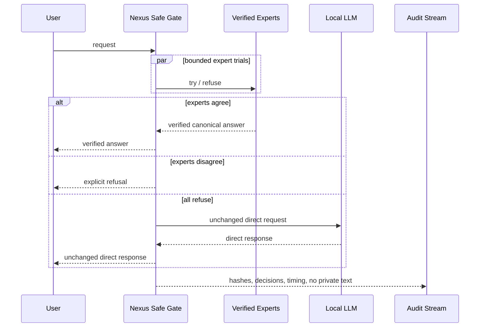

# Architecture overview

MAT Nexus separates **generation** from **verification**.

## Safe request path

1. Normalize a request without adding domain knowledge.
2. Try every applicable bounded expert. Expert refusal is a normal outcome.
3. Canonicalize successful answers.
4. If successful experts agree, publish the verified answer without an LLM
   rewrite.
5. If successful experts disagree, fail closed and emit an audit event.
6. If all experts refuse, call the original model through a byte-identical
   bypass.

## Why no generative arbiter?

A generative arbiter can rewrite a correct deterministic result. In the safe
path, verification authority remains with bounded executors. An LLM may explain
a result in a separate presentation layer, but that explanation cannot mutate
the canonical answer.

## Qualification

An expert is eligible for production only when it:

- beats or safely complements the raw model in its declared competence;
- passes independent test sets;
- refuses out-of-domain requests;
- produces the required contract;
- passes deterministic verification;
- introduces no paired losses in the safe path.

Prompt-only specialists remain advisory and cannot become verified authorities.
